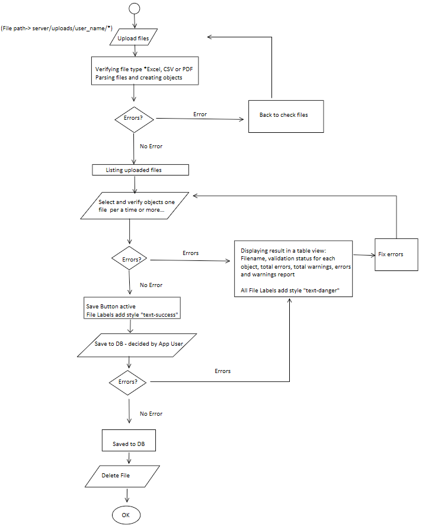

Functions and Usage
====================

Filter
--------

On each overview site (card or list view) for data-table, there are filter left bar, which contains a set of filtering
fields options.
The options are used to filter the whole table and the returned a combined result under the **"and"** condition. It also
privided to select how many entries showing on one page.

The filtering fields(based on data-table fields) options including:
1. txt input fields, which means entries contain any characters in input-field
2. single select fields
3. Multiple-select fields
4. subStructure query (Only for drugs with mol fields) 

On each list-view for data-table, the list table header is a sorting header, meaning the table is sortable by Asc or
Desc ordering per the table header field via dubleclick the table headers.

Filter-Substructrue query
---------------------------
On the filter sidebar for Drug Cards View, a subStructure query option is provided. To use it, clicke chosen item's image and edit Structure showing in the pop window's canvas, then
click get smiles button, close the window turn back to filter fields, click apply to call backend model perform rdkit hassubstructure function search in the corresponded data table.

Export
---------

Each data-table can be selective exported via the export button on right bar menu on the card/list view both. The export
data is in .csv form and contains: the target fields and selected entries.

Import
-------

Import function is currently only available to import vitekcard, vitek_id and vitek_ast data from .pdf files. The
trigger button is located on the right menu bar.
click the button to land the import page. 
the process is showing in the following charts:

- Firstly in uploading and verifying file section:

  selecting the whole folder to upload and then verify the files selected based on the file list diesplaying under confirm button as well as confirm to upload. 
  After confirm, server will verify the files by their types and try to read data from them. Only all the steps done, files will be uploaded and stored 
  under the sub-folder named after the login user name on the server upload folder.
  If file types are not .pdf, .csv and .xlsx, and they can not be parsed by server(read data from). The uploading files will be rejected and need to be 
  modified until passing the uploading verification.

- In select and verify object section:

  the server will verify the data, which it parsed from the uploaded files and created in new entry (in object form), based on the datatables and generat a report. If the data recorder cannot meet the fields requirements, meaning cannot create a data entry, errors will be reported. 
  Some minor errors will also be reported in warning form, however the data entry can be created. So in this case, useres can decide whether create or cancel. 

- In Save to DB section:

  File data will be verify again and written into data base afterwards. In this stage, errors can happens and then the server will report the errors and rejecte to write data to database.

The file uploading process provides a detailed log and error reports which can be useful to clean and modify the files until passing to database. 

DATA visulazation
-------------------

The screening data can be visulized in pivot tables or other data visulization types. Currently on the vitekcard listview click the "char/table" tab, the server will create pivotable based on filtered/selected data  

